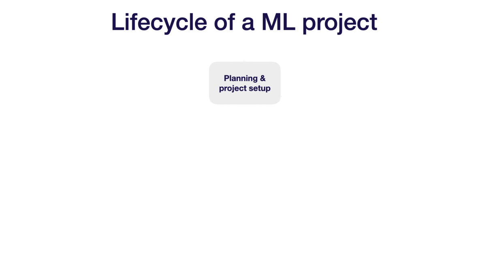
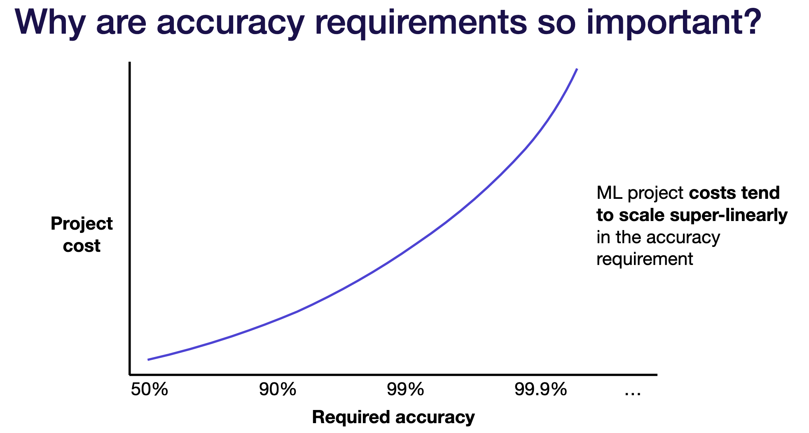
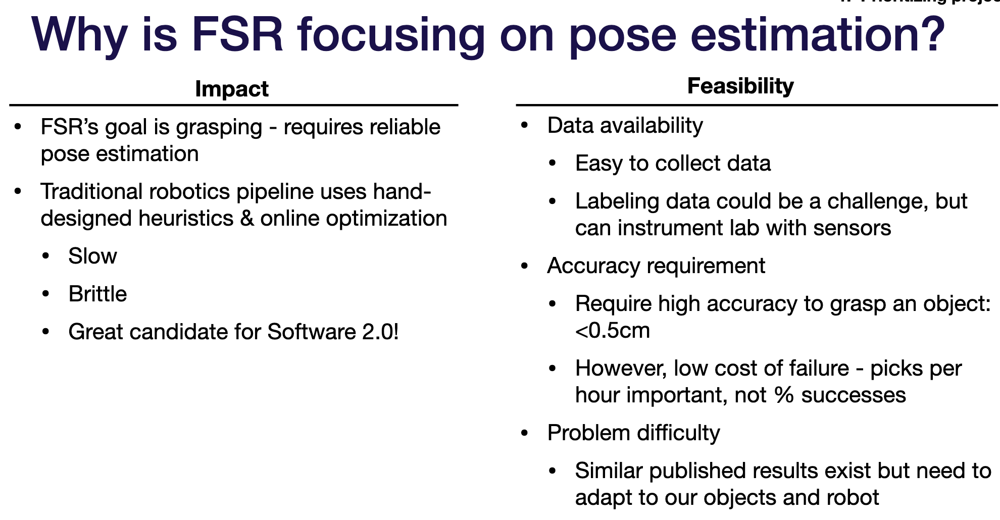
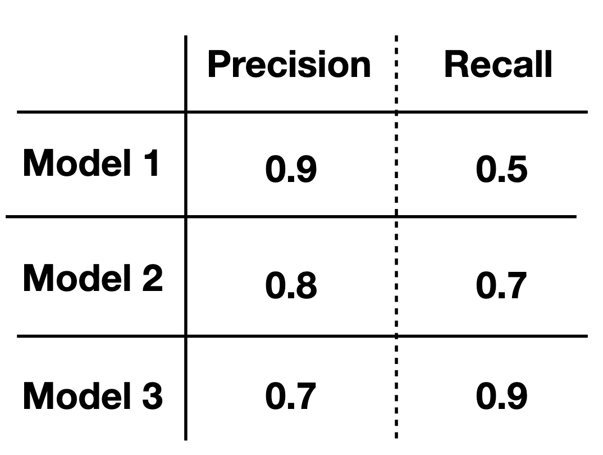
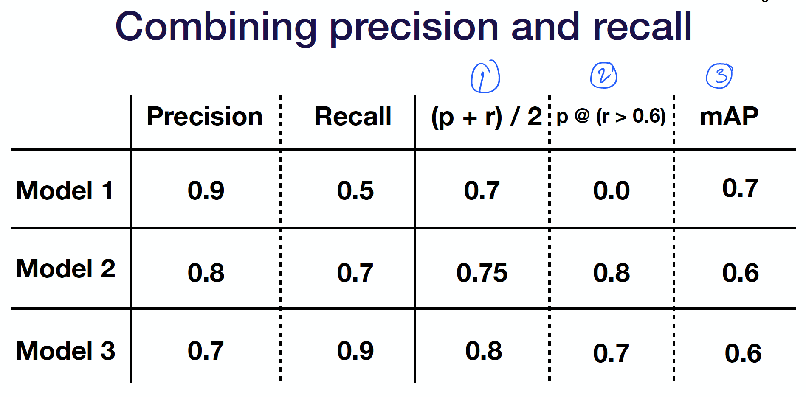

[Full Stack Deep Learning](https://fullstackdeeplearning.com/march2019#) is a 2-day bootcamp organized by Pieter Abbeel, Sergey Karayev and Josh Tobin.
Different from fast.ai or the Andrew Ng's Deep Learning Specialization, 
this course focuses more on the practical aspects of deep learning (DL), 
such as productionizing DL, collecting data, defining scopes for the project, etc.

I took the course online from their website. Although I consider myself having
a reasonable amount of experience in Machine Learning and DL,
I have learnt many useful industrial tips and tricks on shipping DL products.

Here are my notes the course, mostly for my own learning.

Lesson 2: Machine Learning Projects
======

## ML Life Cycle
Similar to software development, building an ML product is pretty much an iterative process.
The lifecycle of an ML project has 4 stages:

1. Planning and project setup

 This is where you define the scope of the project, requirements and goals. It is important to read the relevant literature to make sure you're not designing a moon-shot project.

2. Data collection and labelling

 Certain data will be more easily collected than others, for example collecting social media is fairly, whereas collecting data for pose estimation project is more tricky. It is also worth noting that collecting data as a whole is much easier than getting the data labelled. Sometimes we may need to engage Mechanical Turkers to label the data for us. 

 Note that the size of the dataset depends largely on the type of project. If the project is ML or the usual neural networks, 10k datapoints are usually good. If the project involves images, we may need around 100k images. One clue to help in gauging a rough size of dataset is to follow the datasets used by the papers working on a similar problem. If we are short on data, we can pre-train our model on a bigger but similar dataset, and later finetune with our own dataset.

3. Training and debugging

 We must first identify a baseline approach, one that would give us a reasonable lower bound performance. 
 Thereafter, experiment with more approaches by implementing state-of-the-art models.
 Constantly reading the literature and finetuning the models are key in this step.

4. Deploying and testing

 Lastly, we write tests to prevent regression. Once all are good, we can roll out to production.

Above are the 4 key stages of an ML pipelines. However, note that it is an iterative process. 
So maybe during the data collection phase, you realise the data you wanted are too scarce or it is hard to label the data. 
You may then go back to step 1 to re-scope the project. 
Or maybe during training phase, you realise the model is over-fitting and you need more data to represent the test set. You go back to step 2 to collect more data.

Let this moving gif tell you the general iterative process of an ML pipeline.

## Choosing projects

The key to priotize which projects to work on first is to identiy: 
(1) a high-impact, complex part in your workflow that could be automated by making use of 
(2) cheap predition.

Feasibility of the project is also important. There are 3 components that determine the feasibility:

1. Data availability: How hard is it to acquire and label data? How much data will be needed?

2. Accuracy requirements: How costly are wrong predictions? How frequent is the system allowed to be wrong (e.g. self-driving cars predict incoming cars wrongly vs. Netflix recommendation system predicting next movies to watch wrongly)?

3. Problem difficulty: Is the problem a new problem in academia? If so, more risky and requires more effort. 
Is a lot of compute needed for training?

The higher accuracy requirement, the higher the cost for the project. 
ML project costs tend to scale more than linear in order to push the accuracy higher.

One template ML team can use to justify the work on a certain project is as belows. 
FSR stands for Full Stack Robotics and is an imaginary company. The company wants to build a robotic hand that can grasp objects from one bin to another.
Notice the Impact and the 3 components under Feasibility.

## Choosing metrics

Given different models, metric is used to evaluate which models to keep and which to discard.

For a typical prediction problem, we can always work out the Precision (P) and Recall (R) as the basis metric.

Sometimes, it is not clear which model will stand out.

In this case, there are 3 ways to unite P and R:

1. Simple average / weighted average

2. Threshold on n-1 metrics and evaluate the nth

3. Domain-specific formula

## Choosing baselines

Baseline gives you a lower bound on expected model performance. 

Baselines are important in determining the next action after evaluating a model.
If the model's performance is close to a baseline, the next step to improve is to collect more data or harder fine-tuning. 
But if the model's performance is a lot worse than the baseline, it is an indication that the model is not worth pursuing further -- it is best to choose a different model. 

Where to look for baselines?
- Business/engineering requirements
- Published results in the literature
- Scripted baseline (simple bot / hand-engineered automation)
- Simple ML baselines (linear regressions, bag-of-words models, basic NN without batch norm, weight norm, etc)